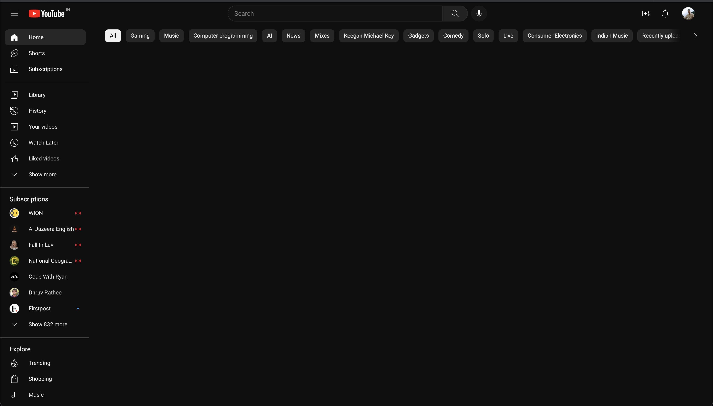

# YouTube Recommended Video Blocker

YouTube Recommended Video Blocker is a Chrome extension that blocks the recommended videos section on YouTube from home and watch page, helping you focus on the content you want to watch without distractions. This extension removes the sidebar section that displays recommended videos, allowing you to have a cleaner and more streamlined YouTube experience.

## Features

- Blocks the recommended videos section on YouTube's home page.
- Blocks shorts on Youtube's search page.
- Blocks side recommended videos on the watch page.
- Provides a distraction-free viewing experience.
- Increases productivity by removing temptations and distractions.
- Simple and lightweight extension.

## Installation

1. Clone or download this repository to your local machine.
2. Open Google Chrome browser and go to `chrome://extensions`.
3. Enable the **Developer mode** by toggling the switch located at the top right corner.
4. Click on the **Load unpacked** button and select the directory where you cloned/downloaded this repository.
5. The extension will be installed and ready to use.

## Usage

Once the extension is installed, it will automatically block the recommended videos section on YouTube whenever you visit the site. Simply navigate to YouTube, and the sidebar section with recommended videos will be hidden from view.

To temporarily disable the extension, you can click on the extension icon in the Chrome toolbar and choose the option to disable it. Clicking on the icon again will re-enable the extension.

## Contributing

Contributions are welcome! If you want to contribute to this project, please follow these steps:

1. Fork this repository.
2. Create a new branch with a descriptive name: `git checkout -b feature/my-new-feature`.
3. Make your changes and commit them: `git commit -am 'Add some feature'`.
4. Push to the branch: `git push origin feature/my-new-feature`.
5. Submit a pull request.

Please ensure your code follows the existing code style, and include relevant tests and documentation with your changes.

## License

This project is licensed under the [MIT License](LICENSE).

## Disclaimer

This Chrome extension is a third-party project and is not affiliated with or endorsed by YouTube or Google. Use it at your own risk.

## Contact

If you have any questions, suggestions, or issues regarding this project, please feel free to contact the project maintainers:

- Viraj Singh - virajsingh5897@gmail.com